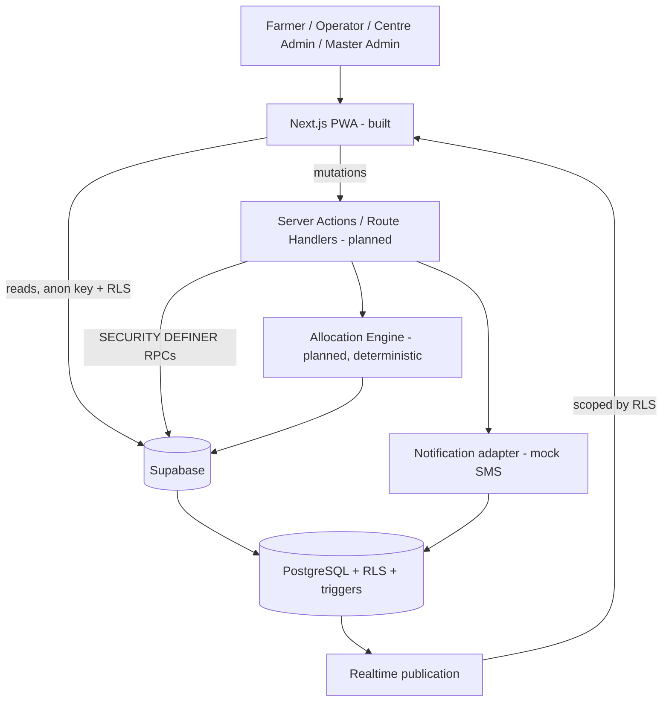

# Architecture

`PLANNED` for everything backend — no Supabase project, no dependencies, no
connection exists. The UI layers described here **are** built (Phases 2A–2D);
everything below the UI is design. See `docs/PROJECT_STATE.md` for the
authoritative built/not-built split.

## System overview

## Layer responsibilities

| Layer | Owns | Explicitly does not own |
|---|---|---|
| **Client (browser)** | Rendering, scoped reads with the anon key, realtime subscriptions, optimistic UI | Authorization, capacity checks, token generation, queue position |
| **Server (Next.js actions/route handlers)** | Invoking RPCs, running the allocation engine, notification dispatch, account administration | Being the security boundary — a bypassed server action must still hit RLS |
| **Database (Postgres)** | The security boundary (RLS), transactional integrity, state-machine guards, audit triggers, derived views, queue position | Presentation concerns (phone masking, stepper labels) |

The division follows one rule: **anything that must be true even if the
client is hostile lives in the database.** Server actions exist for
ergonomics and orchestration, not for enforcement.

### Where each concern lands

- **Reads of own/scoped data** — client or server, anon key, RLS-protected.
  Safe either way, which is the point of doing authorization in the database.
- **Writes that matter** — booking creation, check-in, call-next,
  quality/weighment/procurement, centre status, payment status — go through
  `SECURITY DEFINER` RPCs invoked from server actions. Each needs a
  transaction, a state check, and an audit row; none can be expressed as a
  bare client `INSERT`. See `docs/SECURITY.md` RLS-2.
- **Queue position** — a database function, not a query or a view. Under
  RLS a farmer sees only their own row, so any window function returns 1
  for everyone; this is a silent wrong answer rather than an error, which
  makes getting it right structurally important. `docs/DATABASE.md` §7.3.
- **Audit** — database triggers, never application code. Code paths get
  forgotten; triggers cannot be.
- **Derived values** — remaining capacity, utilisation, effective status,
  ETA, workflow stage — computed in views or pure functions, never stored.

## Backend responsibilities (Supabase)

- **Auth**: Supabase Auth issues sessions (cookie-based, so server
  components share them). `profiles` extends `auth.users` 1:1 via an insert
  trigger. Role lives on `profiles`, not in JWT claims — a claim is a bearer
  fact that outlives a revocation.
- **RLS**: default-deny on every table; policies ship in the same migration
  as their table, never as a later "add security" pass.
- **Realtime**: four published tables only (`centre_status`,
  `centre_queue_state`, `bookings`, `procurement_records`). Publication
  membership is an access-control decision.
- **PostgreSQL**: source of truth for `docs/DATABASE.md`'s schema, plus the
  constraints and triggers that make the state machines real.

## Realtime design

The hard constraint: **a farmer's queue position changes because of a row
they are not allowed to read.** Subscribing to their own booking produces no
event when the farmer ahead of them is called.

Resolution: a small trigger-maintained aggregate row per centre per day
(`centre_queue_state`: waiting count, in-progress count, now-serving token)
that is non-personal and therefore safe for any authenticated farmer to
read. Clients subscribe to that one row, and on change call
`rpc_get_my_queue_position` to refresh their own numbers.

| Change | Published via | Reaches |
|---|---|---|
| Centre opens/pauses/delays | `centre_status` | Farmers, operators, admin |
| Queue advances | `centre_queue_state` | Farmers (aggregate), operators |
| A specific booking changes | `bookings` | Its farmer; operators at that centre |
| Processing progresses | `procurement_records` | Its farmer; operators at that centre |

Not published: `audit_events` (append-only firehose — the Admin feed
refetches), `profiles`, `payment_records`.

## Allocation-engine responsibilities

`PLANNED`. A deterministic, explainable server-side function whose entire
input is one query against `v_centre_availability` plus `centre_commodities`
and `slots`. It returns a recommended centre, slot, ETA, and a reason string
assembled from the same values used in the decision;
`bookings.recommendation_reason` stores that string so the recommendation
stays auditable after the inputs move.

No ranking formula is designed yet — deliberately (`docs/BUSINESS_LOGIC.md`).
No ML, no scoring service, no geospatial infrastructure.

## Notification-abstraction responsibilities

`PLANNED`. `notifications` is an outbox table. One interface
(`sendNotification(farmerId, type, payload)`) writes rows; a mock adapter
marks them `SENT` on the `SMS_MOCK` channel. A real provider later becomes a
worker reading `QUEUED` rows on an `SMS` channel — a new enum value and a
new consumer, not a schema change. **No SMS provider is chosen, integrated,
or assumed**, and no application behaviour depends on delivery succeeding.

`QUEUE_APPROACHING` notifications must be generated server-side on queue
advance: they are triggered by another farmer's progression, and the
recipient's client may not even be open.

## Deployment

`PLANNED`: Vercel hosts the Next.js app; Supabase hosts Auth/DB/Realtime.
No other infrastructure. The service-role key exists only as a Vercel
server-side environment variable, used by at most two paths (notification
dispatch, account administration) and guarded by the `server-only` package
so a client import fails the build rather than shipping the key.

## Security boundary — explicit statement

`DECISION` (unchanged): Next.js route separation (`/farmer`, `/operator`,
`/admin`) is **not** a security boundary. It organizes UI. **Supabase Row
Level Security is the primary data-access security boundary.** Every access
must be safe assuming the client reaches any route, queries any table
directly, and subscribes to any channel. Full model and adversarial review:
`docs/SECURITY.md`.

## Do-not-describe-as-implemented

The UI layer is built and verified (Phases 2A–2D). **Everything from the
server actions down — Supabase, RLS, RPCs, realtime, notifications, the
allocation engine — is design only.** No dependency is installed, no
project is provisioned, and every screen currently renders from clearly
labelled demo modules under `lib/demo/`.
