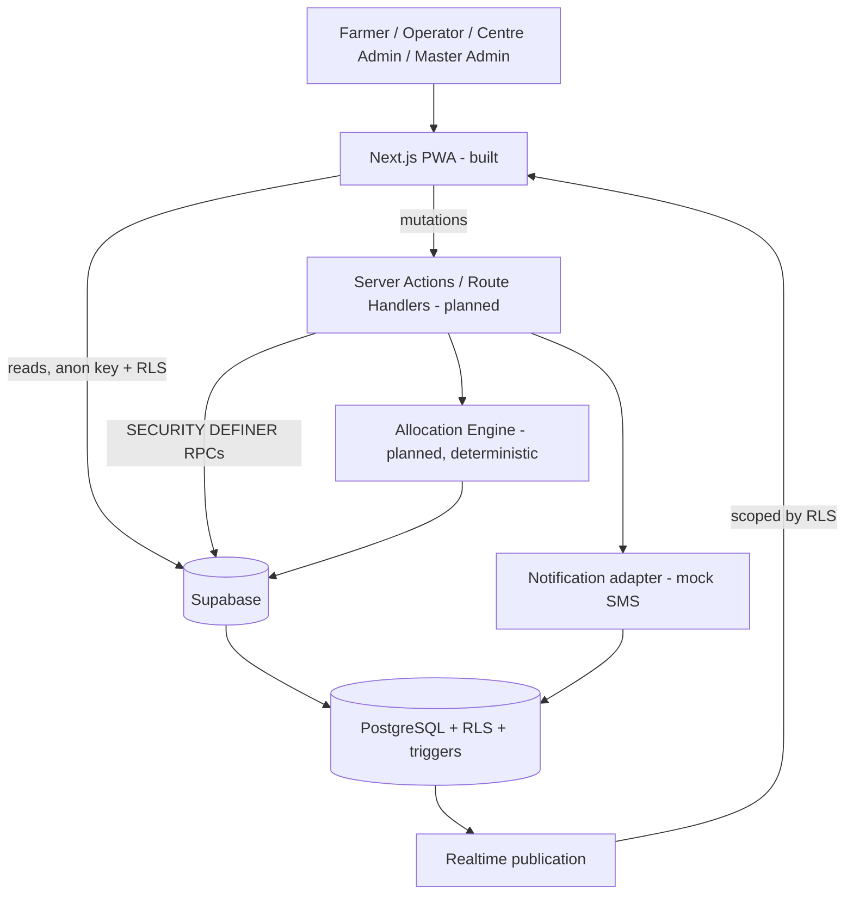

# Architecture

`PLANNED` for everything backend — no Supabase project, no dependencies, no
connection exists. The UI layers described here **are** built (Phases 2A–2D);
everything below the UI is design. See `docs/PROJECT_STATE.md` for the
authoritative built/not-built split.

## System overview

## Layer responsibilities

| Layer | Owns | Explicitly does not own |
|---|---|---|
| **Client (browser)** | Rendering, scoped reads with the anon key, realtime subscriptions, optimistic UI | Authorization, capacity checks, token generation, queue position |
| **Server (Next.js actions/route handlers)** | Invoking RPCs, running the allocation engine, notification dispatch, account administration | Being the security boundary — a bypassed server action must still hit RLS |
| **Database (Postgres)** | The security boundary (RLS), transactional integrity, state-machine guards, audit triggers, derived views, queue position | Presentation concerns (phone masking, stepper labels) |

The division follows one rule: **anything that must be true even if the
client is hostile lives in the database.** Server actions exist for
ergonomics and orchestration, not for enforcement.

### Where each concern lands

- **Reads of own/scoped data** — client or server, anon key, RLS-protected.
  Safe either way, which is the point of doing authorization in the database.
- **Writes that matter** — booking creation, check-in, call-next,
  quality/weighment/procurement, centre status, payment status — go through
  `SECURITY DEFINER` RPCs invoked from server actions. Each needs a
  transaction, a state check, and an audit row; none can be expressed as a
  bare client `INSERT`. See `docs/SECURITY.md` RLS-2.
- **Queue position** — a database function, not a query or a view. Under
  RLS a farmer sees only their own row, so any window function returns 1
  for everyone; this is a silent wrong answer rather than an error, which
  makes getting it right structurally important. `docs/DATABASE.md` §7.3.
- **Audit** — database triggers, never application code. Code paths get
  forgotten; triggers cannot be.
- **Derived values** — remaining capacity, utilisation, effective status,
  ETA, workflow stage — computed in views or pure functions, never stored.

## Backend responsibilities (Supabase)

- **Auth**: Supabase Auth issues sessions (cookie-based, so server
  components share them). `profiles` extends `auth.users` 1:1 via an insert
  trigger. Role lives on `profiles`, not in JWT claims — a claim is a bearer
  fact that outlives a revocation.
- **RLS**: default-deny on every table; policies ship in the same migration
  as their table, never as a later "add security" pass.
- **Realtime**: four published tables only (`centre_status`,
  `centre_queue_state`, `bookings`, `procurement_records`). Publication
  membership is an access-control decision.
- **PostgreSQL**: source of truth for `docs/DATABASE.md`'s schema, plus the
  constraints and triggers that make the state machines real.

## Farmer queue realtime — the problem and the options

**The constraint.** A farmer's queue position changes because of a row they
are not allowed to read. In a queue `A → B → C`, farmer C's "farmers ahead"
drops from 2 to 1 when A is called — but the row that changed is A's
booking, which RLS correctly hides from C. A farmer subscribed only to
their own booking therefore receives **no event at all** at the exact
moment the thing they care about changes.

The requirement is that C sees `farmers ahead: 2 → 1 → 0` live, while never
seeing A's or B's name, phone, or booking details, and without weakening
farmer RLS anywhere.

### Options considered

**A — Realtime-safe derived queue projection.** A separate table holding one
anonymised row per queued booking (token, centre, position, state), readable
by any authenticated user for that centre, published to realtime.

- *RLS*: permissive by design; safe only because rows are stripped of PII.
- *Realtime*: works — subscribers see the whole queue move.
- *Privacy*: pseudonymous, not anonymous. Tokens are visible to neighbours
  in a physical queue, so a determined observer can track a specific person
  over time. Low harm, but it is a real widening.
- *Performance*: **disqualifying.** Position is a property of the whole
  queue, so every call-next rewrites every row behind the called farmer —
  O(n) write amplification and O(n) realtime events per single action.
- *Consistency*: positions must be trigger-maintained across many rows;
  drift is easy and silent.
- *Complexity/scalability*: highest of the five, and it degrades fastest.

**B — Secure RPC returning farmer-specific queue state.** A
`SECURITY DEFINER` function that validates ownership, counts ahead-of-me
rows server-side, and returns scalars only.

- *RLS*: ideal. The widened read happens inside a function that returns no
  rows, only aggregates.
- *Realtime*: **none.** Pull-only. The farmer has to know *when* to ask,
  which means polling — wasteful when idle and laggy when busy.
- *Privacy*: strongest of the five; nothing about other farmers leaves the
  database.
- *Performance*: one indexed count per call. Cheap.
- *Consistency*: exact at call time.
- *Complexity*: low.

**C — Centre-level aggregate realtime state.** One trigger-maintained row
per `(centre, date)` carrying counts, the now-serving token, capacity
headroom and derived status.

- *RLS*: safe — contains no personal data, so it can be readable by any
  authenticated user without weakening anything.
- *Realtime*: one row, one subscription, **one event per queue change**
  regardless of queue length.
- *Privacy*: the only quasi-identifier is the now-serving token, which is
  precisely the information a physical token display shows publicly. The
  implemented farmer UI already renders it.
- *Performance*: O(1) write per queue change. Best of the five.
- *Consistency*: single row, so no cross-row drift is possible.
- *Complexity*: one trigger.
- *Limitation*: it says *something moved* and gives centre-wide numbers —
  it cannot tell an individual farmer their own position.

**D — C + B combined.** Subscribe to the aggregate for liveness and
centre-wide facts; on change, call the RPC for the caller's own precise
position.

- Inherits C's O(1) write path and B's exactness and privacy.
- *Cost*: one RPC round-trip per queue event per subscribed farmer — N
  network calls per call-next. At MVP scale (tens of farmers per centre)
  this is negligible, and each call is a single indexed count. It is
  network-side O(n), not database-write-side O(n), which is the far
  cheaper place to pay.

**E — Client-side arithmetic from the aggregate.** Give each booking a
`queue_sequence` at check-in (the farmer can read their own), publish a
departed-count on the aggregate, and let the client compute
`ahead = my_sequence − 1 − departed_count`, avoiding the RPC entirely.

- *Performance*: best possible — no per-farmer round-trip at all.
- *Correctness*: **breaks silently.** The arithmetic is exact only while
  every departure is of a sequence lower than mine. That holds for FIFO
  call-next and for no-shows at the head, but a farmer *behind* me
  cancelling also increments the departed count and makes my displayed
  position too low, with nothing to signal the error.

Option E was rejected specifically because Phase 3A identified
silent-wrong-answer bugs as the dangerous class here, and this reintroduces
one to save a round-trip the system can easily afford.

### Recommendation — **Option D**

`centre_live_state` (the aggregate) is the realtime **signal** and the
source of centre-wide facts; `rpc_get_my_queue_position` is the
authoritative **per-farmer** answer.

The division of labour is the point: the aggregate is cheap, safe and
live but cannot know who is asking; the RPC knows exactly who is asking
but cannot push. Neither alone satisfies the requirement, and together they
need no relaxation of farmer RLS at any point.

Two refinements that keep the round-trips down:

- The aggregate carries a monotonic `version`, so clients coalesce bursts
  (several bookings changing in one transaction produce one refresh).
- The single most time-critical farmer event — *"you have been called"* —
  arrives directly on the farmer's **own** booking row via their own
  filtered subscription, with no RPC needed at all. The aggregate handles
  the ambient "the queue moved" case; the personal event travels on the
  personal channel.

What the farmer sees, and what they never see:

| Visible to the farmer | Never leaves the database |
|---|---|
| Own booking, token, status | Other farmers' names |
| Farmers ahead (a count) | Other farmers' phone numbers |
| Estimated wait | Other farmers' booking details |
| Now-serving token, waiting count | Any row-level access to another booking |
| Centre `effective_status`, capacity headroom | |

## Realtime publication — minimal set

`DECISION` (3A.1): **two published tables**, plus refetch for everything
else. Publication membership is an access-control decision, not a
convenience one.

| Table | Why published | Subscriber scope |
|---|---|---|
| `centre_live_state` | The safe public projection: queue counts, now-serving token, capacity headroom, `effective_status`, `version`. Carries centre pause/resume/delay and capacity changes too, so one subscription covers all ambient centre state | Any authenticated user, filtered by `centre_id` |
| `bookings` | The farmer's own status transitions (`CALLED` above all) and the operator's live queue list | Farmer filtered to own rows; operator filtered to own centre. RLS is the boundary, the filter is for fan-out |

**Dropped from the Phase 3A list:**

- `centre_status` — its changes now propagate through `centre_live_state`'s
  `effective_status` and `delay_reason`, which is where the precedence
  rules already live. Publishing both would mean two events for one change
  and two places to encode precedence.
- `procurement_records` — stage progress is lower-stakes and the farmer is
  standing at the counter when it happens. Refetched on their own booking
  event. Can be added later if the demo wants a live stepper.

**Never published:** `audit_events` (append-only firehose), `profiles`,
`payment_records`, `centre_assignments`.

### Event → carrier map

| Event | Reaches farmers via | Reaches operators via |
|---|---|---|
| Farmer checked in | `centre_live_state` (counts) | `bookings` row insert/update |
| Farmer called | own `bookings` row; others via `centre_live_state` | `bookings` row |
| Processing completed | own `bookings` row; `centre_live_state` counts | `bookings` row |
| Centre paused / resumed / delayed | `centre_live_state` (`effective_status`, `delay_reason`) | same |
| Capacity changed | `centre_live_state` (`farmers_remaining`, `effective_status`) | same |
| Booking cancelled | `centre_live_state` counts; own row if it was theirs | `bookings` row |

**Raw table changes vs projections**: the answer is *both, deliberately
split by audience*. Operators are entitled to row-level detail for their
own centre, so they get the table. Farmers are not, so they get a
projection plus their own rows. There is no case where a farmer receives a
row belonging to someone else.

## Queue position — where the calculation lives

`DECISION` (3A.1). Restating the trap: a window function over
RLS-filtered rows returns **1 for every farmer**, because RLS removes the
other rows before the window sees them. This is a wrong answer, not an
error, so nothing surfaces it in testing except a careful reviewer.

| Question | Answer |
|---|---|
| Where does it run | `rpc_get_my_queue_position(booking_id)` — a `SECURITY DEFINER`, `STABLE` database function, owner a privileged role, `search_path` pinned |
| What rows may it consider | All bookings for that `(centre_id, service_date)` in an active queue status — deliberately more than the caller can see |
| What is returned | Scalars only: `ahead_count`, `estimated_wait_minutes`, `now_serving_token`, `queue_version`. No rows, no identifiers, nothing invertible to a person |
| How RLS stays enforced | The function is the single widened path and validates `booking.farmer_id = auth.uid()` before reading anything. Every other route to that data stays RLS-filtered |
| Anti-oracle guard | "Not your booking" and "no such booking" return the **same** error, so the function cannot be used to probe which booking IDs exist |

**Prohibited by design**: no view, materialised view, or client query may
compute queue position with a window function. If one appears, it is a bug
even when it returns plausible numbers.

## Allocation-engine responsibilities

`PLANNED`. A deterministic, explainable server-side function whose entire
input is one query against `v_centre_availability` plus `centre_commodities`
and `slots`. It returns a recommended centre, slot, ETA, and a reason string
assembled from the same values used in the decision;
`bookings.recommendation_reason` stores that string so the recommendation
stays auditable after the inputs move.

No ranking formula is designed yet — deliberately (`docs/BUSINESS_LOGIC.md`).
No ML, no scoring service, no geospatial infrastructure.

## Notification-abstraction responsibilities

`PLANNED`. `notifications` is an outbox table. One interface
(`sendNotification(farmerId, type, payload)`) writes rows; a mock adapter
marks them `SENT` on the `SMS_MOCK` channel. A real provider later becomes a
worker reading `QUEUED` rows on an `SMS` channel — a new enum value and a
new consumer, not a schema change. **No SMS provider is chosen, integrated,
or assumed**, and no application behaviour depends on delivery succeeding.

`QUEUE_APPROACHING` notifications must be generated server-side on queue
advance: they are triggered by another farmer's progression, and the
recipient's client may not even be open.

## Deployment

`PLANNED`: Vercel hosts the Next.js app; Supabase hosts Auth/DB/Realtime.
No other infrastructure. The service-role key exists only as a Vercel
server-side environment variable, used by at most two paths (notification
dispatch, account administration) and guarded by the `server-only` package
so a client import fails the build rather than shipping the key.

## Security boundary — explicit statement

`DECISION` (unchanged): Next.js route separation (`/farmer`, `/operator`,
`/admin`) is **not** a security boundary. It organizes UI. **Supabase Row
Level Security is the primary data-access security boundary.** Every access
must be safe assuming the client reaches any route, queries any table
directly, and subscribes to any channel. Full model and adversarial review:
`docs/SECURITY.md`.

## Do-not-describe-as-implemented

The UI layer is built and verified (Phases 2A–2D). **Everything from the
server actions down — Supabase, RLS, RPCs, realtime, notifications, the
allocation engine — is design only.** No dependency is installed, no
project is provisioned, and every screen currently renders from clearly
labelled demo modules under `lib/demo/`.
